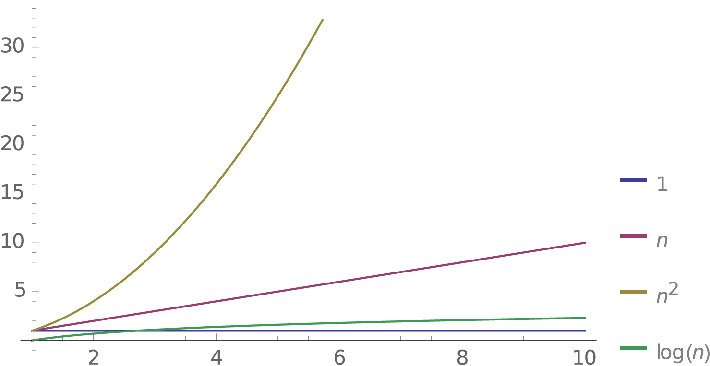

# Reference: Big O Cheatsheet

#### From smallest to largest...

| Big O    | Name        | If n doubles, runtime... | Example       |
| -------- | ----------- | ------------------------ | ------------- |
| O(1)     | Constant    | is unaffected            | Directly access an element in array (i.e. array[5]) |
| O(logn)  | Logarithmic | increases by 1           | Binary search |
| O(n)     | Linear      | doubles         | Linear search |
| O(n^2)   | Quadratic   | quadruples       | Nested loop |

### Graphical Representation of the Big O's
