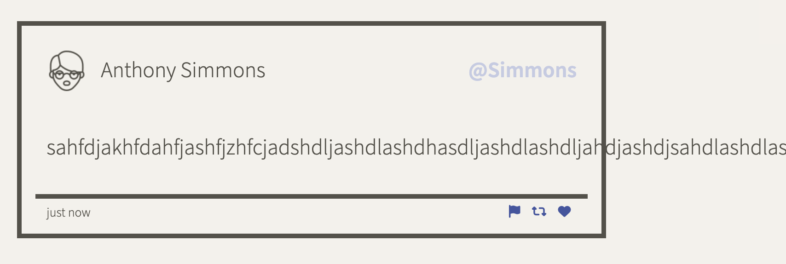

# Code Review: Tweeter

The page doesn't work if the user submits long text with no spaces in-between, aka ["overflowing text"](https://developer.mozilla.org/en-US/docs/Web/CSS/CSS_text/Wrapping_breaking_text). 



### Solution: 
```css
word-break: break-all;
```


