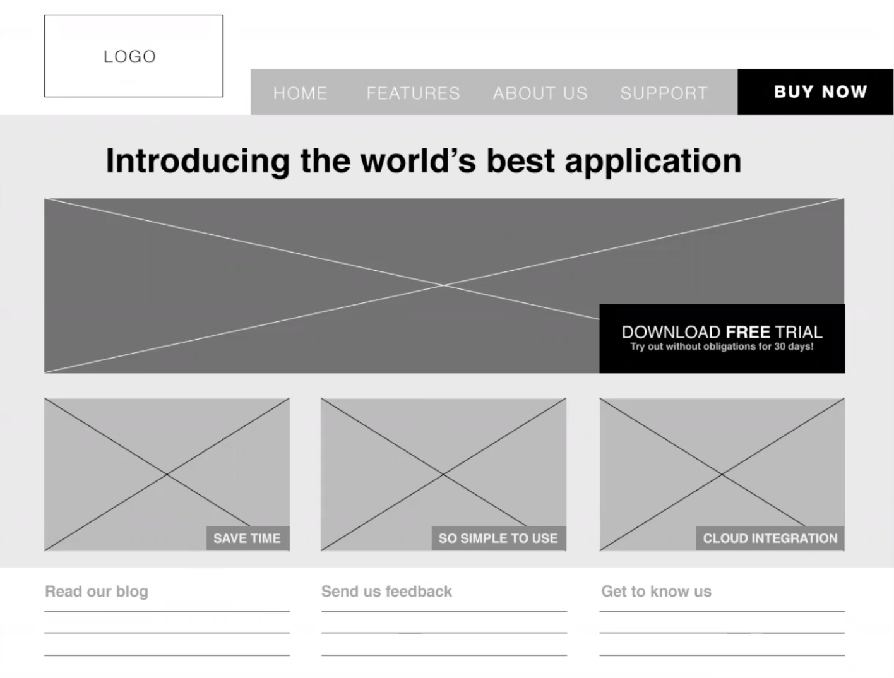

# Midterm Project Kickoff

### Purpose of the Midterm Project
* To practice what you've already learned and put it all together - frontend, server-side, and database!
* Learning how to work with others

### Pick a Project
Stand-outs:
* Quiz app
* Food pick-up order
* Smart to-do list

### User Stories
* Describe how a user will interact with our application (based off of the requirements)
* As a _______, I can ________, because ________
* Create a planning directory in your repo and store your user stories there (user-stories.md)
  * Aim for 6-10 user story sentences

Examples:
* As a logged-in user, I can see a list of available maps, because I am interested in things happening in my area
* As a user, I can favourite a blog post, because I want to read it later AND the heart icon turns red
* As a non-logged in user, I cannot edit a map, because it doesn't belong to me

### Pick out the Nouns in the Stories
* Nouns === resources === tables
* Build the ERD from there!

### Routes to ineract with the resources
* REST (REpresentational State Transfer) - naming convention
  * If you need a refresher, [review CRUD notes](../Week_6/L9_CRUD_with_Express.md)
* You may not need all of these, depending on your project!
* List all routes in your planning directory (routes.md)

Example using BREAD:
* Browse, GET - /users
* Read, GET - /users/:id
* Edit, POST - /users/:id
* Add, POST - /users
* Delete, POST - /users/:id/delete

### MVP vs. MVD
MVP - Minimum Viable Product
* What is the MINIMUM feature set that a user will find useful?
  * Need to get to market ASAP so that we can start making money, and then can add more cool features later!

MVD - Minimum Viable Demo
* Since we aren't taking this to market, focus on making the *Minimum Viable Demo (MVD)* instead!
* What features can we effectively show off in 5 minutes? 
  * **If you're not going to show it, don't build it!**
  * Project killer: "Wouldn't it be cool if..."

### Wireframe/Mockup
* Design the front end
* A simple wireframe ensures that anyone on the team can implement the design
* Include in planning directory (wireframe.png)

Example:


### User Registration and Login
* Lighthouse Recommendation: Don't do it
  * You don't want to spend a min out of your five minutes logging in

Recommendation:
```js
// localhost:3000/login/7
app.get('/login/:user_id', (req, res) => {
  // Option 1: set the cookie
  req.cookies.user_id = req.params.user_id;

  // Option 2: using cookie-parser
  res.cookie('user_id', req.params.user_id);

  // send the user somewhere
  res.redirect('/home');
});
```
* You will STILL need a users table and seed it with data, but you don't have to worry about passwords, registrations, etc.

### Tech Choices
* Backend - node, express, postgres
  * Seperate each table into its own file
* Fronend - HTML, CSS, JS, jQuery
  * Try to incorporate SASS!

### SPA vs. Multi-Page App
* Not mutually exclusive - could have a multi-page app that has some SPA functionality

### Git
* Do not code on main!!!!
* Decide how you are going to merge - locally vs. on the cloud. As a professional developer you will always be merging on the cloud via pull requests, so keep that in mind!

### Splitting up the Work
* Vertical - every member of the team is working on a different piece of the stack
  * Advantage: less likely to be working on the same file, so less likely to encounter merge conflicts
  * Merge conflicts are NOT the end of the world though, and happen often in the real world!
* Horizontal - every member working on the same layer
* Pair Programming 

* TIP: do NOT try and pick something you are already good at! Instead, pick areas you need more practice in.

### Communication
* If you are going to have a problem in this project, THIS is where it will be - not in the coding.
* This is so so so important! Make sure you have a plan for this communication.