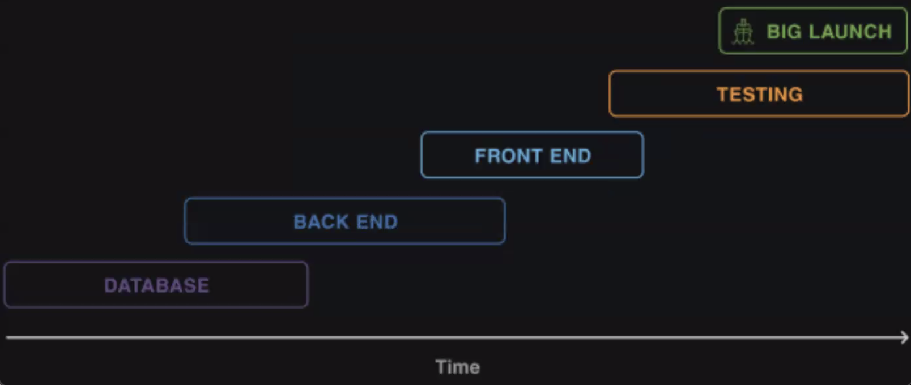
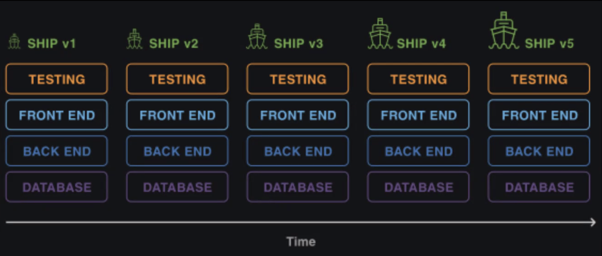
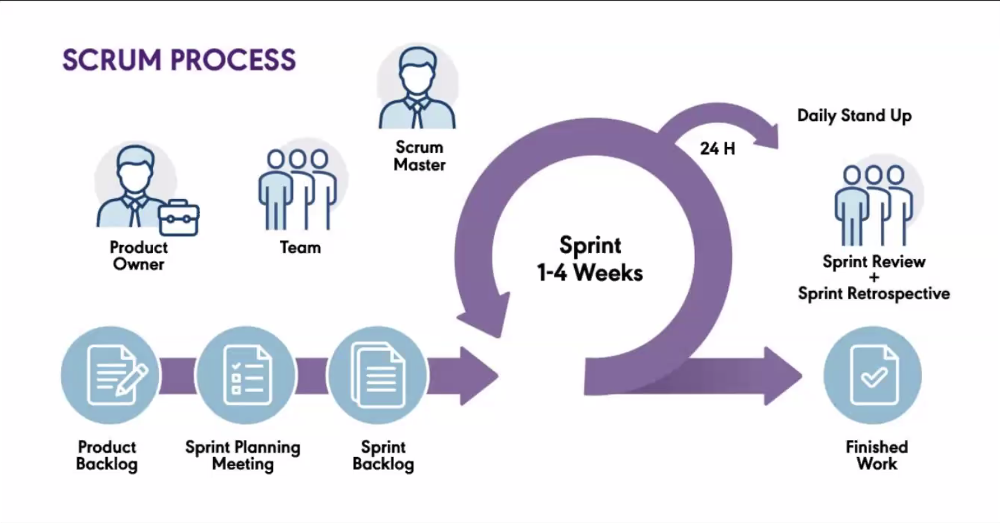

# Lecture 30: Project Planning

### Waterfall
* more traditional approach -- plan everything up front!
* much less flexible
* however, it is much easier to plan for time off, what to expect each month, etc.
* lots of analogies to a traditional building / engineering approach, where you can't put the walls up if you haven't poured the foundation

### Agile
* philosophy &rarr; [agilemanifesto.org](agilemanifesto.org)
* iterative approach: rather than building up to a big product after 3-4 years, launch small pieces at a time
* focus on building the MVP, and then continue adding features
  * these projects are virtual, so we don't need to wait for the foundation to put up the walls, so to speak
* "Working software is the primary measure of progress" &rarr; not code coverage, not testing, not addressing all edge cases, not proper code commenting, documentation, or keeping things DRY
  * this highlights a major downside of this approach: the tendency to accrue technical debt, aka things you know you should've done but didn't have time to address

### Scrum
* methodology

Some common terms:
* Product Backlog &rarr; a living document that lists all features that need to be completed
* Sprint &rarr; piece of work / deliverable (1-3 weeks)
* Sprint Backlog &rarr; breaking the features down into sprints
* Sprint Execution &rarr; original codebase is locked so that the code cannot lose quality (in theory); must be complete within agreed timeframe
* Daily Scrum / Daily Standup &rarr; generally everyone each shares the answer to these three questions:
  1. What did we do yesterday?
  2. What are we working on today?
  3. What were the roadblocks?
* Scrum Master &rarr; person responsible for ensuring the sprint finishes on time (run into a roadblock? Ask your scrum master to help!)

### Planning out a Project
1. User Stories
  * Bring this back with Cypress to test that all these user stories work!
2. Nouns / resources (ERD)
3. Routes (RESTful)
4. Wireframes / Frontend
5. Setup Github 
6. Naming / File Conventions
  * Don't want to reinvent the wheel and make your own styleguide? Take from a popular, established one, like the [Airbnb JavaScript style guide](https://github.com/airbnb/javascript), or at least use it as launch pad to creating your own
7. Setup project structure
8. Setup the workflow and task
  * Can use Github hooks to allow for more consistency in the workflow
9. Decide on communication

Book to check out: [Practical Object-Oriented Design In Ruby](https://www.poodr.com/)

### Keeping Track of Tasks
* kanban board (minimum 3 columns: to do, in progress, done)
* can use something like Trello, or the new Github projects

### Keeping Track of Time
* have a calendar, like Google calendar
* use a time-tracking app like [Harvest](getharvest.com) or [Tickspot](tickspot.com)
* use a technique like the [Pomodoro method](pomofocus.io) to both keep you productive as well as can be used to time-track (i.e. it took me 4 pomodoros to complete that task)

### Stay Organized
* have a schedule, esp. if you work from home! Have a protected time and space where you get your work done
  * how do you get into "work mode"? Where are you working, what are you wearing, what device are you working on, etc.?
* use note-keeping software like Onenote, Evernote, Bear, etc.
* keep your documentation open while you work: [devdocs.io](devdocs.io), [offline Dash](kapeli.com/dash)