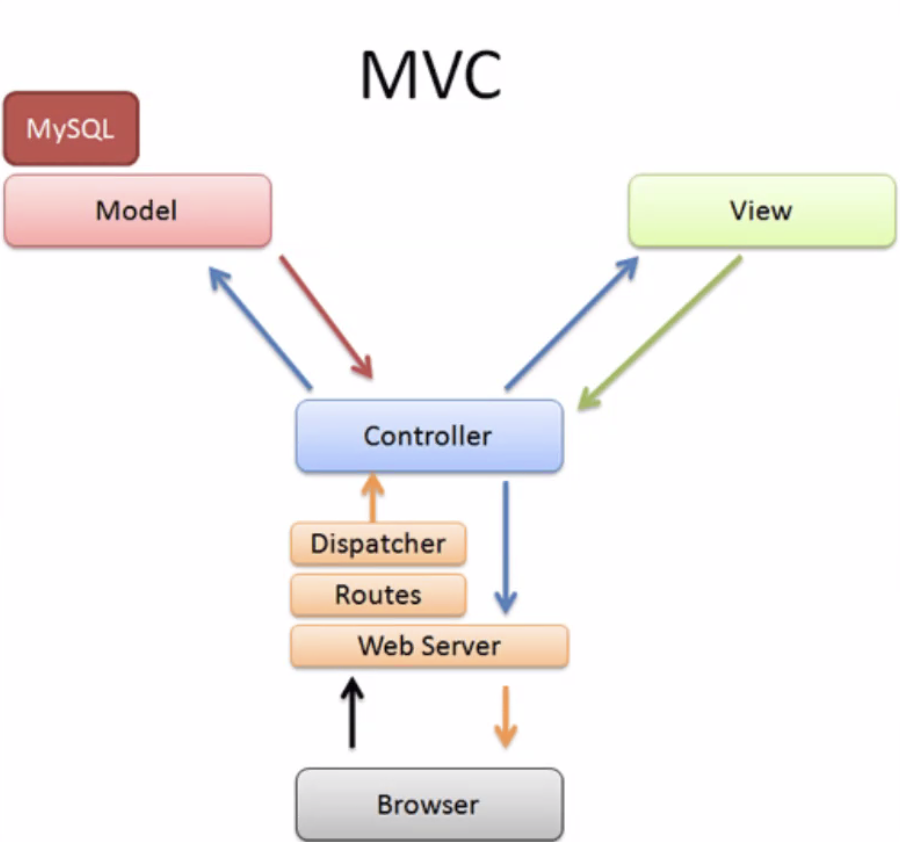

# Lecture 32: Intro to Rails

### MVC (or MVCR)
* Model - data abstraction layer (doesn't matter if you use postgres, mysql, etc., this layer will work the same)
* View - UI; generates the HTML, collection of helper functions
* Controller - brains of the operation
* Router - determines which controller to call



### Rails Example App
* To create your new Rails app with its default settings, use ```rails new {name of app}```
  * ```--database=psql``` &rarr; sets the database, as by default it will be set to SQLite
  * ```--api``` &rarr; if you are using React, you can disable the 'View' part

* Find some fake data to build our app around via [Faker for Ruby](https://github.com/faker-ruby/faker)
  * In your Gemfile, add the line ```gem Faker```

* ```byebug``` &rarr; put this anywhere you would normally put a ```puts``` to debug!

* instead of using ```touch```..., much more often you will be using ```rails generate```... in a rails app, as it will include everything necessary for you to get started using it
  * ```rails generate model location``` &rarr; generate a model called Location

db/{timestamp}_create_locations.rb
```rb
class CreateLocations < ActiveRecord:Migration[6.1]
  def change
    create_table :locations do |t|
      t.string :name

      t.timestamps
    end
  end
end
```
* Where is the Primary Key? Rails does that for you *automatically*, and will be prensent via **id**
* This is one example of many where we see *Convention over Configuration*, which is the philosophy that Ruby & Rails operate by

db/{timestamp}_create_characters.rb
```rb
class CreateCharacters < ActiveRecord:Migration[6.1]
  def change
    create_table :locations do |t|
      t.string :name
      t.string :quote
      t.references :location, foreign_key: true, index: true
      # :location is distinct from :locations => use the one you need based on relationship you are establishing!
      # setting index to true will speed up our selects! They should ALWAYS be set to true on foreign keys.
      
      t.timestamps
    end
  end
end
```
* ```rails db:migrations```
  * ```rails``` == ```bin/rails``` == ```bin/rake``` &rarr; as of Rails 5, you can just use the ```rails``` command, although you will see the others in the wild
* schema.rb &rarr; treat this like a read-only file! If you need to adjust the table, create a new migration and it will update the schema for you.

* Based off of the schema, the models already know what data they store, so that data does not need to be repeated in the model
* Instead, the model is used to create [validations](https://guides.rubyonrails.org/active_record_validations.html)

location.rb
```rb
class Location < ApplicationRecord
  has_many :characters # location.characters => will return all characters from a location
end
```

```rb
location = Location.new
location.save

# ==

Location.create
```

seeds.rb
```rb
puts "creating the locations"
20.times do
  Location.create(
    name: Faker::JapaneseMedia::OnePiece.location
  )
end

puts "querying the locations"
locations = Location.all

50.times do
  Character.create(
    name: Faker::JapaneseMedia::OnePiece.character
    quote: Faker::JapaneseMedia::OnePiece.quote
    location: locations.sample # Will give us a random location from our locations array
  )
end

puts "all done!"
```

* ```rails db:seed```

* ```rails console``` &rarr; opens up the models in the terminal w/o the server
  * ```Character.all``` &rarr; list all characters
  * ```Character.find(5)``` &rarr; find the character where id = 5

config/routes.rb
* Usually routes.rb is the only file you will alter in config!
```rb
Rails.application.routes.draw do
  # Create individual endpoints
  get 'login', controller: 'users', action: :index
  # ==
  get 'login', to 'users#index'

  # Bulk create endpoints
  resources :locations # this will create EIGHT endpoints automatically!
  resources :locations, only: [:index, :show] # will only create the two endpoints we need
  resources :locations, except: [:index, :show] # will create the other six endpoints, but not index & show
end
```
* ```rails routes``` &rarr; all routes available; if you only want to see the routes that you have created, they will be listed at the top!

* ```rails g controller locations``` &rarr; creates the locations controller 
  * if you don't do this step after setting up the routes, rails will give you an error of an "uninitialized constant" controller!

controllers/locations_controller.rb
```rb
class LocationsController < ApplicationController
  def index 
    @locations = Location.all # instance variables (w/ '@') are automatically sent to template
    # render 'index' => this line of code runs automatically! No need to write it.
  end
end
```

views/locations/index.html.erb
```html
<h1>All the locations!</h1>

<!-- Three ways of adding an anchor tag -->
<a href="/characters">Characters</a>
<%= link_to "Characters", "/characters" %>
<%= link_to "Characters", characters_path %>

<% @locations.each do |location| %>
  <div class=location>
    <h2>Name <%= locations.name %></h2>
  </div>
<% end %>
```

* Want to use Node for your final project? Check out sequelize, NextJS