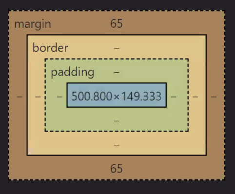

# Lecture 12: Introduction to CSS

### HTML vs. CSS
* HTML is known as a "markup language", as it provides the structure of the page
* CSS is what gives the page style! Colours, fonts, margins, etc.


### What are Static Files?
* Static files are anything that is unchanging, i.e. CSS files, client-side JS, etc.
```js
app.use(express.static('public')); // Instead of using app.get for every static file, you can add this line and Express will bring them all in! This automatically includes index.html.
```

### HTML Parent-Child Relationships
```html
<!DOCTYPE html> <!-- HTML TAG: Great-grandparent / Grandparent -->
<html lang="en">
  <head> <!-- HEAD TAG: Grandparent -->
    <title>Demo</title> <!-- TITLE TAG: Parent; "Demo": Child -->
  </head>
  <body> <!-- HEAD TAG: Parent -->
     <!-- IMG TAG: Child** -->
  </body>
</html>
```

* **Self-closing tags cannot have descendents 

### HTML5 Semantics
* In the old days, in order to label a particular div, you would have to give it a particular id

```html
<div id="header"></div>
```

* As of HTML5, we have more [semantically meaningful elements](https://www.w3schools.com/html/html5_semantic_elements.asp) we can use!
  * Important to note these are all just divs underneath the hood. So, even if you use a footer element, if it's at the top of the HTML file, that is where it will show up on the page!

Examples:
```html
<header></header>
<main></main>
<aside></aside>
<footer></footer>
```

Using semantic elements have many benefits:
  * Keep your code organized for you and other developers working with your code
  * Increase accessibility for those who use page-readers to interact with your website
  * Improve SEO to better describe what your web page contains

### In-line Style vs. Style Tags
* In-line styling is considered **extremely bad practice** in the industry!

```html
<p style="font-size: 50px; color: hotpink">
```

* Instead, at least contain everything in the style tag
  * Even better: contain all CSS in a seperate file

```html
<head>
  <style>
    #main-content {
      font-size: 50px;
      color: hotpink;
      text-decoration: underline;
    }
  </style>
</head>
<body>
  <p id="main-content"></p>
</body>
```

### CSS Selectors 
Broad to Specific:
* Elements - p {}, div {}, etc.
* Classes - .main {}
* ID - #main-content {}
* In-line Styles

You can also combine them!
* i.e. target divs that have a class of aside: div.aside {}

### Seperate CSS File
```html
<head>
  <link rel="stylesheet" href="practice.css"/>
</head>
```

practice.css
```css
#main-content {
  font-size: 50px;
  color: hotpink;
  text-decoration: underline;
}
```

### Box Model
* Made up of four parts, from inner to outer:
  1. Content &rarr; the element itself, i.e. header, paragraph, image, etc.
  2. Padding &rarr; puts space in-between the content and the border
  3. Border &rarr; default: invisible line
  4. Margin &rarr; puts space in-between the border and other elements on the page



* Play around with the [Interactive Box Model](http://guyroutledge.github.io/box-model/) to see it in action!

### Content-Box vs. Border-Box
Two options for box-sizing:
1. content-box &rarr; only indicating how big the content itself is, not taking into account the padding or border
2. border-box &rarr; indicates how big the whole border is, which in itself also contains the padding and content
  * This is typically much easier to work with!

You will probably include this on the top of every CSS file you create!
  * The astrericks is a catch-all for every element on the page
```css
* {
  box-sizing: border-box;
}
```

### CSS Reset / Normalize
Using one of these helps the website look the same on a variety of browsers and devices.
* [Here](https://meyerweb.com/eric/tools/css/reset/) is an example of one that you could include in your CSS file
* You will also see resets that just use the astericks instead of a long list, like this one does

You can either copy-and-paste one of these into your CSS file, or you can use the link tag and import it in. 
* Be sure to comment where you got it from!

```html
<head>
  <link rel="stylesheet" href="reset.css">
  <link rel="stylesheet" href="practice.css">
</head>
```

* *ORDER MATTERS!* If you list the reset.css after the practice.css, you will reset all the CSS you applied in practice.css.

### Selector Specificity
A more specific CSS selector will override those that are more broad.
* A class will override an element style, an id will override both a class and an element style, and an in-line style will override everything!

You can indicate a selector specificity by using the notation (#, #, #), indicating the number of (ids, classes, elements)

Examples:
* p { } &rarr; (0, 0, 1), score: 1
* p.content { } &rarr; (0, 1, 1), score: 11
* p.content.articles { } &rarr; (0, 2, 1), score: 21
* p#main.content { } &rarr; (1, 1, 1), score: 111

Note: in-line styles get a score of 1000 (1, 0, 0, 0)